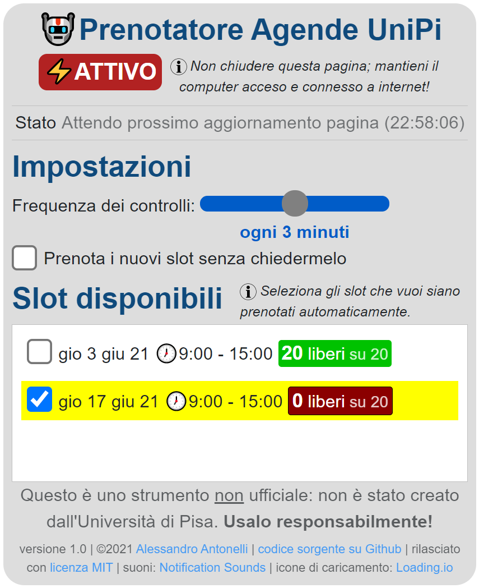

# 🤖Prenotatore Agende UniPi
Uno script per Tampermonkey/Greasemonkey che consente di automatizzare la ricerca di posti liberi e la loro prenotazione sulla [piattaforma Agende](https://agende.unipi.it/) dell'Università di Pisa, evitando di dover perdere tempo a controllare periodicamente la pagina.

⚠️ __Disclaimer__: questo è uno strumento __non ufficiale__: non è realizzato né approvato dall'Università di Pisa; è realizzato da uno studente per gli studenti. Non si fornisce nessuna garanzia sul suo funzionamento e non si assume responsabilità sull'uso che altri potrebbero farne!

🙏Usa il prenotatore __responsabilmente__: non attivarlo inutilmente, e cancella la prenotazione se non ti serve più. Ricorda che altri studenti stanno cercando posto come te!

## Come si installa
1. Installa Tampermonkey per il tuo browser:
   * [Chrome](https://tampermonkey.net/?ext=dhdg&browser=chrome)
   * [Firefox](https://tampermonkey.net/?ext=dhdg&browser=firefox)
   * [Opera](https://tampermonkey.net/?ext=dhdg&browser=opera)
   * [Safari](https://tampermonkey.net/?ext=dhdg&browser=safari)
   * [Dolphin](https://tampermonkey.net/?ext=dhdg&browser=dolphin)
   * [UC Browser](https://tampermonkey.net/?ext=dhdg&browser=ucweb)
2. [Scarica lo script cliccando qui](https://github.com/alessandro-antonelli/prenotatore-agende-unipi/raw/main/Prenotatore%20Agende%20UniPi.user.js). Nel tuo browser dovrebbe aprirsi una tab di Tampermonkey.
3. Clicca su "Installa"
4. Fatto!

## Come si usa
1. Apri il link di un'agenda nel tuo browser
2. Nella finestra "Slot disponibili", metti la spunta su tutti gli slot che vuoi prenotare
   * _Limitati all'essenziale: evita di togliere posto agli altri inutilmente!_
4. Fatto! Lo script inizierà ad aggiornare periodicamente la pagina finché non troverà posto negli slot selezionati. In quel caso effettuerà automaticamente la prenotazione, e sarai avvertito da un avviso acustico.

NB:
* Perché il prenotatore possa funzionare, il computer deve essere mantenuto acceso e connesso a internet, e la pagina dell'agenda deve essere mantenuta aperta nel browser. Se il computer viene spento o la pagina chiusa, il prenotatore smetterà di controllare! Si consiglia di disattivare lo standby nelle impostazioni del sistema operativo.
* Puoi regolare la frequenza di aggiornamento nelle impostazioni.

## Limitazioni note
* Se per qualunque ragione il refresh della pagina fallisce (ad es. perché in quel momento la connessione è assente, il server del sito Agende non risponde, o risponde con un codice di errore), il prenotatore smette di funzionare e, quando la connessione/il server ritorna a funzionare, non è in grado di riattivarsi da solo; per riattivarlo è necessario un intervento manuale (bisogna ricaricare manualmente la pagina). Questo è dovuto al fatto che i browser non consentono alle estensioni di iniettare script nelle pagine di errore del browser.